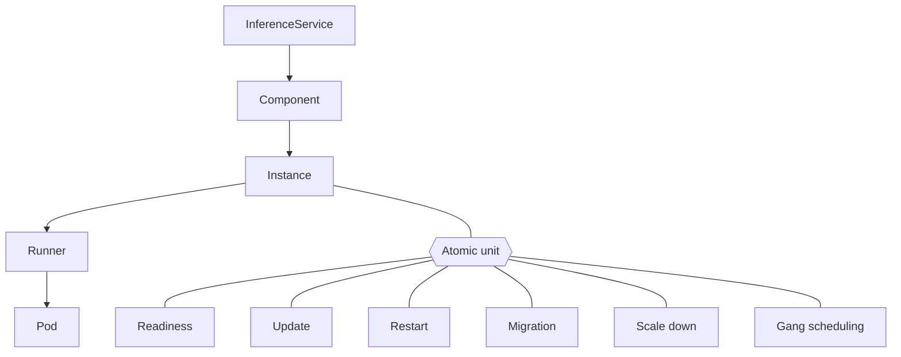
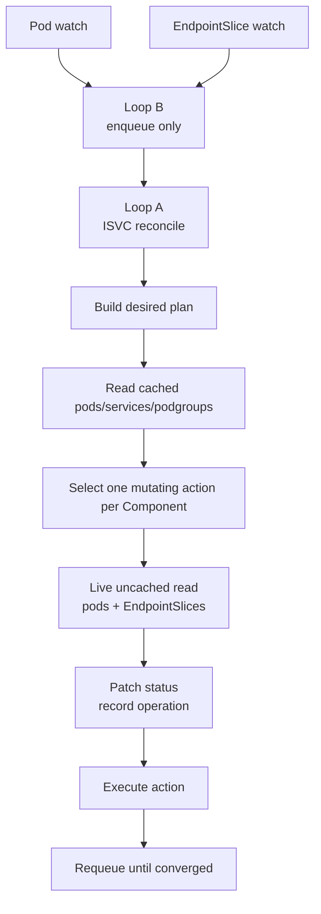
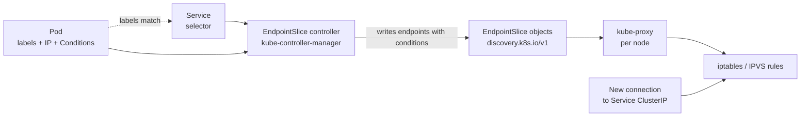
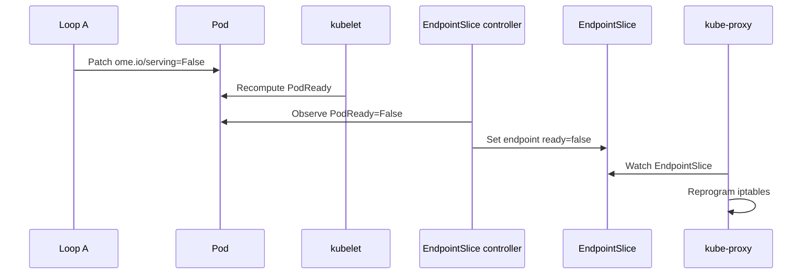
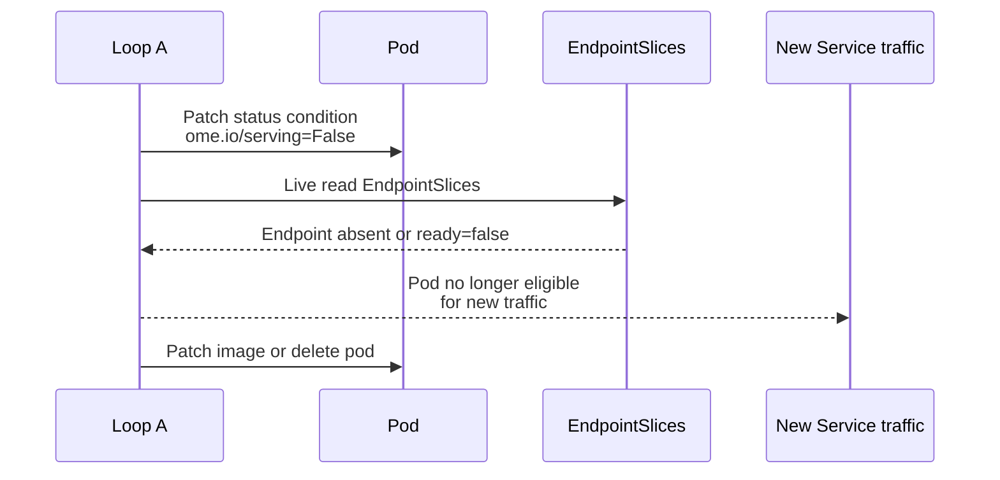
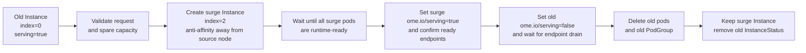

# OMENative Controller Mechanics

> This document defines the v1 controller-level mechanics for
> OMENative.
>
> `README.md` is the product-level OEP, and
> `design-questions.md` is the decision ledger. The three documents
> must stay consistent, but low-level reconcile behavior, watches,
> and file layout are specified here.

## 0. Decisions Locked By This Document

This mechanics design makes the following choices explicit:

1. **OMENative manages Pods directly.**
   It does not emit one `StatefulSet` per `(Instance, Runner)`.
2. **Instance atomicity is the primary correctness property.**
   All mutating operations are instance-scoped and act on the full pod
   set of the Instance.
3. **OMENative defines one controller-owned readiness gate on every
   pod:** `ome.io/serving`.
   This is used for traffic drain before update, restart, migration,
   and scale-down.
4. **OMENative does not use Pod finalizers for correctness.**lets
   Recovery must work even if a Pod disappears before the controller
   sees `DeletionTimestamp`.
5. **Migration in v1 is surge-only.**
   There is no rolling "move part of the Instance" path in v1.
6. **Autoscaling is out of scope for OMENative v1.**
   No HPA is created for OMENative-managed Components.
7. **Gang scheduling in v1 supports only scheduler-plugins
   Coscheduling.**
   Volcano and Yunikorn are explicitly deferred.
8. **Controller-generated PVC templating is out of scope for
   OMENative v1.**
   Runner templates may reference existing volumes/PVCs, but
   OMENative does not synthesize per-pod PVCs.
9. **Cross-Component coordinated rollout is deferred from this
   mechanics design.**
   This file covers single-Component correctness only.

These cuts are intentional. They remove the unsound parts of the
previous draft and leave a controller that is implementable without
hand-waving over Kubernetes semantics.

---

## 1. Model

OMENative organizes one workload as:

```text
InferenceService
  -> Component   (router | engine | decoder)
    -> Instance  (one logical replica of that Component)
      -> Runner  (leader | worker | default)
        -> Pod   (directly created by OMENative)
```



### 1.1 Instance

An **Instance** is the atomic unit for:

- readiness
- restart-on-loss
- rollout/update
- migration
- scale down
- gang scheduling

If an Instance contains 1 leader pod and 3 worker pods, OMENative does
not treat those as independently updateable or independently drainable.

### 1.2 Stable Pod Identity

Every pod name is stable for the lifetime of the Instance:

```text
<isvc>-<component>-<instance>-<runner>-<pod>
```

Examples:

```text
llama-70b-engine-0-leader-0
llama-70b-engine-0-worker-0
llama-70b-engine-0-worker-1
llama-70b-engine-0-worker-2
```

The controller sets:

- `metadata.name` = stable pod name
- `spec.hostname` = same as pod name
- `spec.subdomain` = `<isvc>-<component>-headless`

That gives stable DNS without depending on StatefulSet.

### 1.3 Sparse Instance Indices

Instance indices may become non-dense after migration.

Example:

```text
before migration: {0, 1}
after migration:  {1, 2}
```

This is acceptable. Nothing in the controller assumes density:

- Services select by Component labels, not instance density
- PodGroup names use the actual instance index
- status reports `Replicas` as "number of live Instances", not
  `max(index)+1`

Instance indices are therefore identifiers, not array ordinals.

---

## 2. Resources OMENative Emits

Per Component:

- one routing Service (`<isvc>-<component>`)
- one headless peer-DNS Service (`<isvc>-<component>-headless`)
- one `ControllerRevision` history stream
- one `PodDisruptionBudget` when disruption control is configured

Per Instance:

- N pods, directly created by OMENative
- one `PodGroup` in `scheduling.x-k8s.io/v1alpha1` when the Instance
  has more than one pod

Per InferenceService:

- status under `InferenceService.Status.Components[...]`
- one OMENative-owned audit ConfigMap for migration history and UUID
  dedup ledger

OMENative v1 does **not** emit:

- `StatefulSet`
- `HorizontalPodAutoscaler`
- generated PVCs from `volumeClaimTemplates`

### 2.1 Ownership And Garbage Collection

All OMENative-emitted objects are owned by the parent
`InferenceService`.

- Component-scoped resources use an `OwnerReference` to the
  `InferenceService`:
  - routing Service
  - headless Service
  - `ControllerRevision`
  - `PodDisruptionBudget`
  - OMENative audit ConfigMap
- Instance-scoped resources also use an `OwnerReference` to the same
  `InferenceService`:
  - pods
  - `PodGroup`

OMENative does **not** invent an intermediate "Instance CR" only to hold
owner references. Instance identity lives in labels and in
`InferenceService.Status`.

GC is a safety net, not the primary lifecycle mechanism:

- Loop A still performs explicit delete ordering during update, restart,
  scale down, and migration
- owner references ensure leaked children are eventually collected if the
  parent `InferenceService` is deleted
- owner references do **not** make stable-name reuse safe; create paths
  still require a live read proving the old object is gone before
  reusing the name

### 2.2 Revision Objects And Collision Handling

OMENative uses `ControllerRevision` as the durable history for
steady-state Component intent.

For each Component:

- render the **steady-state** desired plan
- canonicalize it into revisioned data
- hash that data to produce the revision name
- create or reuse a `ControllerRevision`

Revisioned data includes:

- Runner templates
- steady-state labels and annotations
- steady-state pod scheduling fields
- steady-state runtime config

Revisioned data explicitly excludes transient operation overlays:

- `ome.io/operation-id`
- migration-only anti-affinity / preferred target-node hints
- readiness-gate status values
- any temporary drain or rollout annotations

That distinction matters. A migration must not manufacture a new rollout
revision just because it used a temporary placement overlay.

Each Component status tracks:

- `ObservedGeneration`
- `CurrentRevision`
- `UpdateRevision`
- `CollisionCount`

If a hash collision occurs, OMENative increments `CollisionCount`,
recomputes, and retries exactly as a revisioned controller should.

Default revision retention is 10 non-live revisions per Component.

---

## 3. Status Model

OMENative persists only the minimum transition state needed to survive
controller restarts.

```go
type ComponentStatus struct {
    ObservedGeneration int64

    CurrentRevision string
    UpdateRevision  string
    CollisionCount  *int32
    LabelSelector   string

    Replicas             int32
    ReadyReplicas        int32
    AvailableReplicas    int32
    UpdatedReplicas      int32
    UpdatedReadyReplicas int32

    Conditions []metav1.Condition

    InstanceStatuses []InstanceStatus
}

type InstanceStatus struct {
    Index           int32
    Incarnation     int64
    Phase           InstancePhase
    RunningRevision string
    TargetRevision  string

    PodCount           int32
    ReadyPodCount      int32
    AvailablePodCount  int32
    ScheduledPodCount  int32
    NodesOccupied      []string

    Conditions []metav1.Condition

    Operation *InstanceOperation
}

type InstanceOperation struct {
    ID        string
    Type      string   // Create | Update | Restart | Migrate | Delete
    Step      string   // explicit step within the operation
    StartedAt metav1.Time
    LastProgressAt metav1.Time
    Deadline       metav1.Time
    RetryCount     int32

    TargetRevision string
    Reason         string

    // migration only
    SurgeIndex      *int32
    FromNode        string
    HintTargetNodes []string
    RequestUUID     string
}

type MigrationHistoryEntry struct {
    ID                  string
    Component           string
    Instance            int32
    ReplacementInstance *int32
    Mode                string
    Phase               string
    RequestedAt         metav1.Time
    StartedAt           *metav1.Time
    CompletedAt         *metav1.Time
    Reason              string
    RequestedBy         string
    Events              []MigrationEvent
    OutcomeReason       string
}

type MigrationEvent struct {
    At      metav1.Time
    Message string
}
```

OMENative v1 does **not** persist a per-runner status sub-list in
`InstanceStatus`. Runner-level debugging is derived from live pods via
the stable `ome.io/runner` label, rather than stored as another status
aggregation layer.

Top-level OMENative status also keeps a rolling
`[]MigrationHistoryEntry`. `ReplacementInstance` is set only for surge
migrations that replace one live Instance index with another.

### 3.1 Phases

`InstancePhase` is one of:

- `Creating`
- `Ready`
- `Updating`
- `Restarting`
- `Migrating`
- `Deleting`
- `Failed`

### 3.2 What Status Is And Is Not

Status is:

- controller-owned
- restart recovery metadata
- operator-visible progress reporting

Status is **not**:

- an API contract users may patch directly
- the only source of truth
- enough on its own to authorize destructive actions

Destructive actions always require a **fresh live read** of the target
pods before execution.

Manual status edits are unsupported. The controller may overwrite them,
but it does not promise graceful behavior under arbitrary status
corruption.

### 3.3 Condition Set

Component-level conditions:

- `Available`
- `Progressing`
- `FailedScale`
- `FailedUpdate`
- `GangSchedulingUnavailable`
- `OperationStuck`

Instance-level conditions:

- `AllPodsScheduled`
- `AllPodsReady`
- `AllPodsAvailable`
- `Drained`
- `Failed`

These conditions are not decorative. They are the operator-facing view
of why an Instance is blocked or why a Component is degraded.

### 3.4 Availability Semantics

OMENative distinguishes:

- **Ready**: pod reports runtime readiness and controller-owned
  readiness gates are `True`
- **Available**: pod has remained Ready for `minReadySeconds`

At the Component level:

- `ReadyReplicas` = Instances whose pods are fully Ready
- `AvailableReplicas` = Instances whose pods are fully Available
- `UpdatedReplicas` = Instances on `UpdateRevision`
- `UpdatedReadyReplicas` = Instances on `UpdateRevision` and fully Ready

OMENative v1 defaults `minReadySeconds` to 0, but the mechanics design
keeps the `Available` distinction so rollout and future scale behavior
have a stable place to anchor.

### 3.5 Instance Incarnation

Stable pod names still need a way to distinguish old materialization from
new materialization.

Each `InstanceStatus` therefore carries a monotonic `Incarnation`.

- initial create => `Incarnation=1`
- full recreate update => increment
- restart-on-loss => increment
- delete => InstanceStatus removed
- in-place update => do **not** increment
- surge migration => the surge Instance starts at `Incarnation=1`
  because it has a new Instance index

The controller stamps the current incarnation onto all Instance-scoped
objects:

- pod label `ome.io/instance-incarnation`
- `PodGroup` annotation `ome.io/instance-incarnation`
- any operation-scoped events / logs

This token is not part of revision history. It is lifecycle identity, not
workload version.

### 3.6 Field-by-Field Rationale

The status model is not a record of internal state. It is the minimum
durable evidence a crashed controller needs to resume work, plus the
observable contract external clients (operators, Alfred, HPA) depend on.
Each field answers one specific question.

#### Revision Tracking: `CurrentRevision`, `UpdateRevision`, `CollisionCount`

A `ControllerRevision` is an immutable, named snapshot of the Component's
steady-state pod template (§2.2). The revision pair lets rollout
decisions be stateless between reconciles.

- `UpdateRevision` is the revision name that reflects
  `InferenceService.Spec` right now. When the user edits spec, the
  controller renders a new template, hashes it, and either reuses an
  existing revision or creates a new one. `UpdateRevision` points at the
  result. Think: "where we want to be."
- `CurrentRevision` is the revision name where the running pods actually
  are — the one promoted to stable state. During a rollout, new pods
  come up on `UpdateRevision` while the old pods stay on
  `CurrentRevision`. Think: "where we are."

When the two strings are equal the Component is in steady state. When
they differ a rollout is in progress, and the controller knows exactly
what to do without diffing pod specs.

`CollisionCount` is the escape hatch for hash collisions. Revision names
are short hashes, so two different templates can theoretically produce
the same hash. On collision (a create that fails with "exists but data
differs") the controller increments `CollisionCount`, folds it into the
hash input, and retries. Without this counter, a collision would
deadlock rollout forever. Upstream StatefulSet uses the same pattern.

#### Replica Counters

```go
Replicas             int32
ReadyReplicas        int32
AvailableReplicas    int32
UpdatedReplicas      int32
UpdatedReadyReplicas int32
```

These are rollout-pacing inputs, not just observability.

- `Replicas` — total live Instances (any phase).
- `ReadyReplicas` — Instances whose every pod is Ready.
- `AvailableReplicas` — Instances that have been Ready continuously for
  `minReadySeconds`.
- `UpdatedReplicas` — Instances on `UpdateRevision`.
- `UpdatedReadyReplicas` — on `UpdateRevision` and fully Ready.

`UpdatedReadyReplicas / Replicas` drives `maxUnavailable` calculations
during rollout. The `Ready` vs `Available` distinction is deliberate:
`Ready` is instantaneous; `Available` applies the `minReadySeconds`
stability window to filter out flaky-ready pods. OMENative v1 defaults
`minReadySeconds=0` but keeps the field so the distinction lives in the
API without a later schema change.

#### Per-Instance Lifecycle: `Index`, `Incarnation`, `Phase`, `RunningRevision`, `TargetRevision`

- `Index` — stable identifier. May be sparse after migration (§1.3).
  Not an array ordinal.
- `Incarnation` — OMENative-specific disambiguator for stable pod-name
  reuse (§3.5). Without it, a watch event about a long-deleted pod can
  race with new pods that share the same name. Every pod carries the
  label `ome.io/instance-incarnation=<n>`; watch events from older
  incarnations are ignored without needing a parent UID round trip.
- `Phase` — coarse-grained lifecycle state: `Creating`, `Ready`,
  `Updating`, `Restarting`, `Migrating`, `Deleting`, `Failed`. Readable
  by humans; operators' first-look diagnosis.
- `RunningRevision` / `TargetRevision` — same pair as `CurrentRevision`
  / `UpdateRevision` but per-Instance. Lets different Instances in the
  same Component be at different rollout points.

#### The Recovery Anchor: `Operation *InstanceOperation`

This is the most load-bearing field in the status model. Before any
destructive action, the controller writes:

```go
Operation = &InstanceOperation{
    ID:             <uuid>,
    Type:           "Update" | "Restart" | "Migrate" | "Delete" | "Create",
    Step:           "Drain" | "DeletePods" | "WaitZero" | "Recreate" | "WaitReady" | ...,
    StartedAt:      <time>,
    LastProgressAt: <time>,
    Deadline:       <time>,
    RetryCount:     0,
    TargetRevision: <revision name>,
    Reason:         <short cause string>,
}
```

If the controller crashes mid-action, a fresh reconcile reads
`Operation` and resumes from `Step` without having to reconstruct intent
from pod-state diffs.

- `ID` — idempotency key. Same operation retried is a no-op.
- `Step` — fine-grained resume point. An `Update` in `Drain` resumes by
  re-checking drain; in `WaitReady` resumes by re-checking readiness.
- `LastProgressAt` — stall detection. If the step has not advanced past
  its deadline, escalate.
- `Deadline` — hard timeout for the step (defaults in §5.4).
- `RetryCount` — escalation counter for repeated failures.

Without `Operation`, a crashed controller on restart would have to
replay pod diffs to guess what it was doing. With it, recovery is one
live read and a resume step.

#### Observability and External Contracts

- `LabelSelector` — string form consumed by the subresource scale
  endpoint and by HPA.
- `Conditions` — standard K8s `metav1.Condition` list. Component-level
  and Instance-level types enumerated in §3.3.
- `NodesOccupied` — which nodes an Instance's pods currently run on.
  Alfred reads this to select defrag candidates without listing pods.

### 3.7 Field-to-Question Summary

| Question | Answered by |
|---|---|
| Has the controller processed the current spec? | `ObservedGeneration` |
| Where are we targeting? | `UpdateRevision` (Component) / `TargetRevision` (Instance) |
| Where are we actually running? | `CurrentRevision` (Component) / `RunningRevision` (Instance) |
| Has a hash collision occurred? | `CollisionCount` |
| How far along is the rollout? | `UpdatedReadyReplicas` / `Replicas` |
| Has this Instance been stable long enough to count as available? | `AvailableReplicas` + `minReadySeconds` |
| Is this Instance in a destructive action right now? | `Operation != nil` |
| Where do we resume after a controller crash? | `Operation.Step` + live read |
| Is this pod from the current materialization or an old one? | `ome.io/instance-incarnation` label vs `InstanceStatus.Incarnation` |
| Which nodes is this Instance on? | `NodesOccupied` |
| What selector should HPA use? | `LabelSelector` |

---

## 4. Pod Template Contract

When OMENative renders a pod from a Runner template, it injects:

- labels:
  - `ome.io/inferenceservice`
  - `ome.io/component`
  - `ome.io/instance-index`
  - `ome.io/instance-incarnation`
  - `ome.io/runner`
  - `ome.io/pod-index`
  - `ome.io/managed-by=OMENative`
  - `ome.io/revision-hash`
- annotations:
  - `ome.io/operation-id` when a mutating operation is in flight
- env vars:
  - `OME_INFERENCESERVICE_NAME`
  - `OME_COMPONENT`
  - `OME_COMPONENT_REPLICAS`
  - `OME_INSTANCE_INDEX`
  - `OME_RUNNER`
  - `OME_RUNNER_SIZE`
  - `OME_RUNNER_INDEX`
  - `OME_LEADER_ADDRESS`
  - `OME_INSTANCE_SUBDOMAIN`
- readiness gate:
  - `ome.io/serving`

### 4.1 Controller-Owned Readiness Gate

Every OMENative pod is created with:

```yaml
spec:
  readinessGates:
    - conditionType: ome.io/serving
```

The controller writes the corresponding Pod status condition:

- `True`  => pod may receive Service traffic
- `False` => pod is draining / not eligible for traffic

This gate exists on every pod from creation time. The controller never
tries to add a new readiness gate to a live pod.

### 4.1.1 Readiness Gate Merge Rules

OMENative appends its controller-owned gate to any preexisting pod
readiness gates from:

- the ServingRuntime template
- the component Runner template
- existing OME pod-spec passthrough fields

Rules:

- if `ome.io/serving` is already present, OMENative reuses it rather than
  duplicating it
- OMENative never removes or rewrites user-declared readiness gates
- OMENative only writes Pod status conditions for controller-owned types
  such as `ome.io/serving`
- pod readiness remains the conjunction of:
  - containers ready
  - all user/runtime readiness gates
  - `ome.io/serving=True`

That keeps OMENative compatible with OME's existing PodSpec surface while
still giving the controller one explicit traffic-drain lever.

### 4.1.2 Env Contract And Compatibility Window

OMENative's primary runtime contract is the `OME_*` env var set above.

During migration from LWS-backed runtimes, OMENative may also inject
temporary compatibility aliases:

- `LWS_LEADER_ADDRESS = OME_LEADER_ADDRESS`
- `LWS_GROUP_SIZE = total pod count of the OMENative Instance`
- `LWS_WORKER_INDEX = stable rank within the full Instance`

Whole-Instance rank is defined as:

1. leader runner pods first
2. then worker/default runner pods in rendered runner order
3. within a runner, ascending pod index

This alias mode exists only to ease migration of current runtime
templates that still consume `LWS_*`. New OMENative-native runtimes
should read `OME_*` directly.

### 4.2 In-Place Eligibility

An Instance is eligible for in-place update only when the rendered pod
diff is limited to:

- `spec.containers[*].image`
- controller-managed pod labels / annotations

Any diff touching:

- env
- args
- command
- volumes
- volume mounts
- affinity / tolerations / scheduler
- security context
- sidecars / init containers
- host networking / ports

forces full Instance recreate.

If any pod in the Instance is not in-place eligible, the whole Instance
uses recreate semantics.

### 4.3 Steady-State Template Versus Operation Overlay

OMENative treats pod rendering as two layers:

- **steady-state template**: the desired long-lived pod shape that
  belongs in revision history
- **operation overlay**: short-lived mutation applied only for one
  controller action

Examples of operation overlays:

- migration anti-affinity away from `from_node`
- preferred target-node affinity hints
- `ome.io/operation-id`
- temporary drain state

This split lets OMENative:

- keep revision history semantically clean
- retry operations without inventing fake revisions
- compare "what version should this Instance run?" separately from
  "what temporary maneuver is in flight?"

### 4.4 Lifecycle Timing Knobs

OMENative carries forward the useful parts of RBG's lifecycle model.

Per Component, the controller may be configured with:

- `gracePeriodSeconds`
  meaning: extra wait after endpoint drain and before image patch or
  pod delete
- `minReadySeconds`
  meaning: time a Ready pod must remain stable before it counts as
  Available
- `markNotReadyDuringLifecycle`
  meaning: default `true`; lifecycle transitions first revoke serving
  eligibility before destructive work

OMENative v1 does **not** support arbitrary exec hooks here. Runtimes
should continue using normal Pod readiness and `preStop` behavior. These
knobs only control controller timing.

---

## 5. Reconcile Architecture

OMENative runs two loops.

### 5.1 Loop A: InferenceService Reconcile

Keyed by `(namespace, isvc-name)`.

Loop A is the only loop allowed to:

- create pods
- delete pods
- patch pod spec
- patch pod status readiness gate
- create / delete PodGroups
- patch `InferenceService.Status`
- append audit history

High-level flow:

```text
1. Fetch InferenceService and referenced runtime/model objects.
2. Build desired Component -> Instance -> Runner -> Pod plan.
3. Read cached pods/services/podgroups/controllerrevisions.
4. Derive observed status from the cache.
5. Select at most one mutating action per Component.
6. Before executing that action, perform a live uncached read of the
   target Instance pods (and EndpointSlices if drain is involved).
7. Patch status to record the operation.
8. Execute the action.
9. Requeue until the operation converges.
```



#### 5.1.1 Serialization Rules

- One Loop-A reconcile per InferenceService key at a time.
- At most one mutating operation per Component at a time.
- An Instance cannot start a new operation while `Operation != nil`.

That is intentionally conservative. It keeps the state machine simple
and avoids conflicting operations such as `Update + Migrate` on the
same Instance.

### 5.2 Loop B: Pod / EndpointSlice Watches

Loop B watches:

- pods with `ome.io/managed-by=OMENative`
- EndpointSlices for OMENative Services

Loop B may only:

- enqueue Loop A
- emit metrics / debug logs

Loop B is an accelerator, not an authority. Correctness must not depend
on seeing a specific watch event.

If a pod disappears before Loop B observes it, Loop A still recovers by
comparing the desired plan with a fresh live pod list.

### 5.3 Expectations And Orphan Safety

Stable pod names create a real name-reuse problem. OMENative therefore
uses expectation tracking, similar in spirit to RBG:

- after issuing pod creates, record expected pod names in memory
- after issuing pod deletes, record expected deletions in memory
- suppress duplicate creates/deletes while those expectations are
  outstanding

Expectations are an optimization, not durable state. On controller
restart they are lost, and Loop A rebuilds truth from live reads.

Loop A must also detect orphans before reusing a stable pod name:

- if a live pod exists with the desired name but is not part of the
  current steady-state target, it is an orphan
- if a live pod exists with the desired name but wrong revision or wrong
  operation overlay, it is also an orphan for create purposes
- if a live pod exists with the desired name but a different
  `ome.io/instance-incarnation`, it is also an orphan for create
  purposes

For multi-pod Instances, OMENative does not create replacement pods
until the whole set of blocking orphans has been cleared.

### 5.4 Operation Timeouts And Backoff

Every `InstanceOperation` records:

- `StartedAt`
- `LastProgressAt`
- `Deadline`
- `RetryCount`

Loop A updates `LastProgressAt` whenever an operation advances to a new
step.

Default step deadlines:

- create / recreate / restart pod readiness: 15 minutes
- in-place image patch convergence: 10 minutes
- EndpointSlice drain wait: `max(2 minutes, gracePeriodSeconds + 30
  seconds)`
- zero-pod confirmation after delete: 60 seconds
- full migration operation: 30 minutes

Alfred-facing request lifecycle timers are separate from these internal
operation deadlines:

- annotation observe / accept-or-reject SLA: 30 seconds from first
  observation
- caller retry threshold if the annotation key still exists: 5 minutes
- stale unacknowledged request TTL: 1 hour

Those timers govern the request/acknowledgment contract only. Once a
request is accepted, the internal operation step deadlines above are the
canonical execution timers.

Default migration throttles:

- cluster-wide in-flight migration cap: 3
- cluster-wide max migrations started per rolling hour: 10

Timeout policy:

- waiting-only steps may retry with exponential backoff
  (`5s -> 10s -> 20s -> 40s -> 60s` max)
- in-place update timeout falls back to full Instance recreate at the
  target revision
- create / restart timeout deletes the partial pod set and retries the
  whole Instance up to 3 times before marking the Instance `Failed`
- drain timeout does **not** force-delete still-serving pods; the
  operation fails safe, sets `OperationStuck=True`, and requires a fresh
  reconcile or operator retry
- migration timeout before old-Instance drain deletes the surge attempt
  and keeps the old Instance serving; timeout after old-Instance drain
  has started continues toward a single surviving serving Instance rather
  than attempting rollback
- request annotations that exceed the 1 hour stale TTL without any
  acknowledgment are cleared with event `MigrationRequestStale`

---

## 6. Drain Semantics

The previous draft claimed "flip a readiness gate, sleep, then traffic
is drained." That is too hand-wavy.

This design uses a stricter rule.

### 6.1 Background: How EndpointSlice Drives Service Routing

Before the drain procedure makes sense, the role of `EndpointSlice` in
Kubernetes Service routing needs to be explicit. This subsection is
background for readers who have not worked directly with the
Service-to-Pod data plane.

#### The Service-to-Pod Chain

A Service with a label selector does not directly hold pod IPs. The
EndpointSlice controller inside `kube-controller-manager` materializes
matching pod IPs into one or more `EndpointSlice` objects, and
`kube-proxy` on every node programs the dataplane from those slices.



An EndpointSlice entry looks like:

```yaml
endpoints:
- addresses: [ "10.1.2.3" ]
  conditions:
    ready: true         # consumed by kube-proxy for routing
    serving: true       # pod passes readiness probes
    terminating: false  # pod has a DeletionTimestamp
  targetRef:
    kind: Pod
    name: llama-70b-engine-0-worker-1
```

kube-proxy consults `conditions.ready`: if `false`, the endpoint is
excluded from the iptables / IPVS rule set, and new client connections
to the Service ClusterIP stop hitting this pod.

EndpointSlice replaces the legacy monolithic `Endpoints` resource.
It shards across objects when a Service has many endpoints, and the
tri-state `ready` / `serving` / `terminating` flags let controllers
distinguish "not ready at all" from "draining but still serving
in-flight".

#### How `ome.io/serving` Flows Into Dataplane Decisions

OMENative adds one readiness gate, `ome.io/serving`, to every managed
pod at pod creation time (§4.1). kubelet computes `PodReady` as the AND
of container readiness and every readiness gate. When the controller
wants to drain a pod, it flips the gate to `False`, and the change
propagates through the standard Kubernetes chain:



At this point new client connections to the Service ClusterIP stop
landing on this pod. Only after this chain has converged does the
controller proceed to patch the image or delete the pod (§6.2).

#### Why Observe the Slice Instead of Sleeping

An earlier draft (and several existing group-workload implementations)
sets a fixed `GracePeriodSeconds` after flipping the gate, then patches
the image blindly. That timer has two failure modes:

- **Too short under load.** kube-proxy can take seconds to reprogram on
  a busy control plane. Patching the image before propagation completes
  sends new traffic into an upgrading container.
- **Too long on an idle cluster.** When propagation takes 100 ms, a
  30 s sleep slows every rollout by 300x with no safety benefit.

Reading EndpointSlices directly removes the guess. The controller
proceeds on the observable-truth signal — "kube-proxy has updated
rotation" — not on a timer.

What the slice observation does **not** do:

- It does not cut existing TCP or HTTP connections. In-flight requests
  continue on sockets already opened. Graceful shutdown of those
  connections is the runtime's responsibility (`preStop` hooks,
  `terminationGracePeriodSeconds`, runtime-level drain).
- It does not force client-side connection pools to re-resolve. Clients
  holding long-lived connections may keep them open until the pod
  terminates.

Drain is therefore two phases:

1. **No new traffic.** Observed via EndpointSlice convergence.
   Sub-second to a few seconds on healthy clusters.
2. **In-flight drain.** Bounded by `gracePeriodSeconds` plus
   runtime-level shutdown behavior. Sized to cover `preStop` work and
   expected request duration.

EndpointSlice observation gives a verified upper bound for phase 1.
`gracePeriodSeconds` is the budget for phase 2.

### 6.2 Drain Procedure

For every pod being removed from service:

1. Patch pod status condition `ome.io/serving=False`.
2. Wait until a **live read** of the Component Service's
   EndpointSlices shows the pod endpoint as either:
   - absent, or
   - present with `ready=false`
3. If `gracePeriodSeconds > 0`, wait the additional grace period.
4. Only then proceed to image patch or pod deletion.



### 6.3 What This Guarantees

This guarantees:

- the pod is no longer eligible for new Service traffic

This does **not** guarantee:

- all existing L7 requests have drained
- every client-side connection pool has noticed immediately

Runtime-level connection drain remains the responsibility of:

- readiness probe behavior
- preStop hooks
- graceful shutdown in the serving container

OMENative therefore treats EndpointSlice convergence as the traffic-cut
signal and graceful termination as the in-flight-request budget.

### 6.4 Drain Budget Guidance

`gracePeriodSeconds` is the operator-tunable drain budget, not a magic
constant.

It should be sized to cover, at minimum:

- EndpointSlice publication after `ome.io/serving=False`
- kube-proxy / dataplane convergence to the updated endpoints
- runtime graceful shutdown and in-flight request drain

The controller-owned readiness gate means probe interval is **not** on
the critical path for traffic removal, but readiness-probe timing still
matters for how quickly updated or restarted pods become Ready again.

Operational target:

- choose `gracePeriodSeconds` long enough that new traffic has stopped
  before pod delete / image patch
- choose `instanceReadyTimeout` long enough to cover model warmup after
  the lifecycle transition

OMENative does not claim a universal cluster-wide drain latency SLO in
v1. Clusters and runtimes vary too much. But the controller timing must
be set from the full end-to-end drain path above, not just from the
container shutdown budget in isolation.

---

## 7. The Five Operations

Every mutating operation is instance-scoped.

### 7.1 Create / Scale Up

Sequence:

```text
1. Allocate a new Instance index.
2. Patch status:
     Phase=Creating
     Operation={id,type=Create,step=CreatePods}
3. If the Instance has >1 pod, create its PodGroup.
4. Create every pod in the Instance with:
     - stable name
     - readiness gate present
     - ome.io/serving=False initially
5. Wait until all pods are Running and runtime-ready.
6. Patch ome.io/serving=True on all pods.
7. Wait until EndpointSlices show all pod endpoints ready.
8. Wait until `minReadySeconds` is satisfied for availability.
9. Patch status:
     Phase=Ready
     Operation=nil
```

Pods do not enter service one-by-one. The Instance becomes trafficable
only after the full pod set is ready.

### 7.2 Update

Update is either:

- `mode=inplace`
- `mode=recreate`

chosen per-Instance.

#### 7.2.1 In-Place Update

Use only when the entire Instance is image-only eligible.

Sequence:

```text
1. Patch status:
     Phase=Updating
     Operation={id,type=Update,step=Drain,targetRevision=<new>}
2. Patch ome.io/serving=False on every pod in the Instance.
3. Wait for EndpointSlice drain for every pod.
4. Patch spec.containers[*].image on every pod in the Instance.
5. Wait until every pod reports the target image and runtime readiness.
6. Patch ome.io/serving=True on every pod.
7. Wait until EndpointSlices show every endpoint ready.
8. Wait until `minReadySeconds` is satisfied for availability.
9. Patch status:
     Phase=Ready
     RunningRevision=<new>
     Operation=nil
```

If any pod fails the in-place update or times out, OMENative abandons
the in-place attempt and falls back to full Instance recreate.

#### 7.2.2 Recreate Update

Sequence:

```text
1. Patch status:
     Phase=Updating
     Operation={id,type=Update,step=Drain,targetRevision=<new>}
2. Patch ome.io/serving=False on every currently live pod.
3. Wait for EndpointSlice drain.
4. Delete every currently live pod in the Instance.
5. Wait until a live list shows zero pods for the Instance.
6. Recreate the full pod set at the target revision.
7. Wait until all pods are runtime-ready.
8. Patch ome.io/serving=True on all pods.
9. Wait until EndpointSlices show all endpoints ready.
10. Wait until `minReadySeconds` is satisfied for availability.
11. Patch status:
      Phase=Ready
      RunningRevision=<new>
      Operation=nil
```

### 7.3 Restart On Pod Loss

Trigger:

- a pod is `Failed`
- a pod is missing from the desired set
- a pod is terminating unexpectedly

If the Component restart policy is `RecreateInstanceOnPodRestart`,
OMENative restarts the whole Instance.

Sequence:

```text
1. Patch status:
     Phase=Restarting
     Operation={id,type=Restart,step=Drain,reason=<trigger>}
2. Patch ome.io/serving=False on every still-live sibling pod.
3. Wait for EndpointSlice drain on the still-live siblings.
4. Delete every still-live pod in the Instance.
5. Wait until a live list shows zero pods for the Instance.
6. Recreate the full pod set at the current revision.
7. Wait until all pods are runtime-ready.
8. Patch ome.io/serving=True on all pods.
9. Wait until EndpointSlices show all endpoints ready.
10. Wait until `minReadySeconds` is satisfied for availability.
11. Patch status:
      Phase=Ready
      Operation=nil
```

Correctness does not depend on preserving the first failed pod object.
If it is already gone, OMENative still rebuilds the whole Instance from
the remaining observed set and the desired plan.

### 7.4 Delete / Scale Down

OMENative scales down by deleting complete Instances, never by deleting
some pods from an Instance.

Selection rule:

- delete the newest Ready Instance first

Sequence:

```text
1. Patch status:
     Phase=Deleting
     Operation={id,type=Delete,step=Drain}
2. Patch ome.io/serving=False on every pod in the Instance.
3. Wait for EndpointSlice drain.
4. Delete every pod in the Instance.
5. Wait until a live list shows zero pods.
6. Delete the Instance PodGroup, if any.
7. Remove the InstanceStatus entry.
```

### 7.5 Migrate

Migration is the Alfred-consumed verb.

#### 7.5.1 Request Contract

OMENative accepts only versioned requests:

```json
{
  "schemaVersion": "v1",
  "component": "engine",
  "instance": 0,
  "from_node": "node5",
  "hint_target_nodes": ["node3", "node7"],
  "reason": "fragmentation",
  "requested_at": "...",
  "requested_by": "alfred-controller"
}
```

Requests are keyed by UUID in the annotation name:

```text
ome.io/migration-request-v1-<uuid>
```

UUID dedup is recorded in the audit ConfigMap, not only in the rolling
status window.

The Alfred-facing `30s accept/reject`, `5m retry`, `1h stale`, and
cluster-wide migration throttles are defined in
[§5.4 Operation Timeouts And Backoff](#54-operation-timeouts-and-backoff).
Those values are part of the request-handling contract, even though the
actual execution steps are defined here.

Version-skew rule:

- unsupported `schemaVersion` -> reject the request with
  `UnsupportedSchemaVersion`
- supported `schemaVersion` with unknown additive fields -> ignore those
  fields
- behavioral changes or reinterpretation of existing fields require a
  new schema version and annotation prefix

#### 7.5.2 V1 Migration Mechanics

Only surge migration exists in v1.

Sequence:

```text
1. Validate:
     - request UUID has not already completed
     - no operation is active on the target Instance
     - enough capacity exists for one extra full Instance
2. Allocate surge Instance index = next free identifier.
3. Patch status:
     old Instance:
       Phase=Migrating
       Operation={id,type=Migrate,step=CreateSurge,...}
     surge Instance:
       Phase=Creating
       Operation={id,type=Migrate,step=CreateSurge,...}
4. Create the full surge Instance:
     - same revision as old Instance
     - hard anti-affinity away from from_node
     - preferred affinity to hint_target_nodes
5. Wait until all surge pods are runtime-ready.
6. Patch ome.io/serving=True on surge pods.
7. Wait until surge endpoints are ready.
8. Wait until `minReadySeconds` is satisfied for availability.
9. Drain the old Instance:
     - patch ome.io/serving=False on old pods
     - wait for EndpointSlice drain
10. Delete the old Instance pods.
11. Wait until a live list shows zero old pods.
12. Delete the old PodGroup.
13. Remove old InstanceStatus, keep surge InstanceStatus as Ready.
14. Append Completed entry to status window and audit ConfigMap,
    including source Instance index and replacement Instance index.
```



This means migration changes the live instance identifier. That is
intentional. The controller does not attempt in-place renumbering.

#### 7.5.3 What V1 Migration Does Not Do

OMENative v1 does **not**:

- roll pods within the old Instance one-by-one to a new node
- reuse the old Instance index
- promise weighted traffic split during swap
- migrate if the cluster cannot hold one full extra Instance

If extra capacity is unavailable, the migration is rejected.

---

## 8. Recovery And Crash Safety

### 8.1 Status-First, But Not Status-Only

Before a destructive action, Loop A records the operation in status.

That enables restart recovery:

- crash after status patch, before pod mutation -> next reconcile sees
  the operation and resumes
- crash after some pod mutations -> next reconcile does a live read,
  compares observed pods with the recorded operation step, and resumes

But status alone is never enough. Every resume step rechecks the live
pods before acting.

### 8.2 No Finalizer Dependency

The previous draft used a Pod finalizer to hold tombstones until the
controller "made a decision." That is no longer part of the design.

Reasons:

- correctness should not depend on observing `DeletionTimestamp`
- cached status can be stale
- holding Pod GC does not improve atomic restart enough to justify the
  complexity

Instead, OMENative treats any missing or failed pod in a Ready Instance
as sufficient evidence to start Instance restart logic.

### 8.3 Cache Lag Rule

Cached informers are used for:

- discovery
- enqueueing
- broad planning

Live uncached reads are used for:

- deciding whether an Instance is really missing pods
- confirming zero pods remain before recreate
- confirming EndpointSlice drain before image patch / delete
- confirming the target set of pods for a destructive action

This is the core anti-split-brain rule for the mechanics design.

---

## 9. Gang Scheduling

OMENative v1 supports only scheduler-plugins Coscheduling.

### 9.1 When PodGroup Is Required

If an Instance has more than one pod:

- create one `PodGroup` named
  `<isvc>-<component>-<instance-index>`
- set `spec.minMember = total pod count of the Instance`
- set `spec.scheduleTimeoutSeconds` (default 60)
- label every pod with:
  `pod-group.scheduling.sigs.k8s.io/name=<podgroup-name>`

Scheduling policy annotations with prefix `scheduling.x-k8s.io/` may be
copied onto the `PodGroup` so cluster operators can tune Coscheduling
without OMENative inventing a second policy surface.

OMENative should follow the exact scheduler-plugins key used by the
deployed version. In v1 we intentionally match the same label contract
already used by RBG's working scheduler-plugins manager.

Single-pod Instances do not need a PodGroup.

### 9.2 Unsupported Configurations

The following are not supported in v1:

- `gangScheduler=none` for multi-pod Instances
- Volcano
- Yunikorn

If a multi-pod Instance is configured without Coscheduling available,
the controller sets the Component degraded and refuses to create the
Instance.

---

## 10. Explicit Deferrals

The following are outside this mechanics design and must not be
described as solved by v1:

- HPA / autoscaling for OMENative
- cross-Component coordinated rollout
- rolling migration without surge capacity
- scheduler support beyond scheduler-plugins Coscheduling
- controller-generated PVC templates
- field-level Alfred RBAC hardening (belongs in the Alfred design)
- autoscaling adapter implementation, though the likely future path is
  an ISVC-scoped scale adapter analogous to RBG's ScalingAdapter

---

## 11. Failure Modes

| Failure | Recovery |
|---|---|
| Controller crashes mid-operation | Resume from status + live pod read |
| Pod disappears before watch event arrives | Next reconcile sees desired/observed mismatch and restarts the Instance |
| EndpointSlice drain is slow | Operation stays in `Drain` step until timeout |
| In-place update partially succeeds | Delete and recreate the whole Instance at target revision |
| Migration request replayed | UUID dedup from audit ConfigMap makes it a no-op |
| Migration target capacity absent | Reject the request; do not start partial movement |
| Coscheduling missing for multi-pod Instance | Set degraded condition; refuse creation |
| User patches status directly | Unsupported; controller may overwrite or fail the operation |

---

## 12. Integration With Current OME Controller

This mechanics design is not a new top-level controller. It plugs into
the existing `InferenceService` controller stack.

### 12.0 Impact On Existing Deployment Modes

OMENative is a **new backend**, not a replacement default for every
existing workload shape.

Mode impact in v1:

- `RawDeployment`
  - remains the default for single-pod Components
  - remains the preferred shape for simple engine-only or router-only
    workloads that do not need OMENative's Instance lifecycle
  - Alfred may act on these via the K8s Eviction API when the workload is
    explicitly safe for eviction
- `MultiNode`
  - remains temporarily supported
  - is the primary deprecation target that OMENative is meant to replace
  - Alfred should not auto-migrate these by eviction
- `PDDisaggregated`
  - remains temporarily supported when backed by LWS
  - engine and decoder are the primary multi-Component deprecation target
    for OMENative
- `Serverless`
  - unchanged
- `MultiNodeRayVLLM`
  - unchanged
- `VirtualDeployment`
  - unchanged

Selection rule:

- if a Component is a single pod and does not need first-class migration,
  group restart semantics, or gang scheduling, use `RawDeployment`
- if a Component is multi-pod per logical replica, or Alfred needs
  first-class surge migration rather than eviction, use `OMENative`

This keeps OMENative aligned with Alfred's real need:

- Alfred already has a safe action for single-pod `RawDeployment`
  workloads: eviction
- Alfred needs OMENative's migration verb specifically for workloads
  where eviction is unsafe or too disruptive

### 12.0.1 Single-Pod Components: `RawDeployment` Versus `OMENative`

For a single-pod engine, the default answer is **stay on
`RawDeployment`**.

Rationale:

- the current OME controller and tests already treat single-pod engine as
  `RawDeployment`
- `RawDeployment` already fits the existing status, ingress, and service
  paths cleanly
- Alfred can already defragment single-pod `RawDeployment` workloads via
  eviction, which is a narrower and cheaper mechanism than OMENative's
  full Instance state machine

Single-pod `OMENative` is still allowed as an explicit opt-in when the
operator wants:

- one uniform migration API across both single-pod and multi-pod
  workloads
- controller-owned drain before update or delete
- future convergence on one workload backend for selected Components

But that is an opt-in operational choice, not the default recommendation.

### 12.0.2 Multi-Component Selection (Router + Engine + Decoder)

When an `InferenceService` has multiple Components (`router` + `engine`,
or `router` + `engine` + `decoder`), selection is made **per Component**,
but **engine and decoder are coupled**.

Coupling rule:

- `engine.deploymentMode` **must match** `decoder.deploymentMode` when
  both are present
- `router.deploymentMode` is independent

Rationale for the coupling:

- PD serving has runtime coupling: the decoder needs the partner
  engine's leader address, KV-cache handoff assumes symmetric lifecycle,
  future coordinated rollout treats the pair as one unit
- Asymmetric modes (e.g. engine `OMENative`, decoder `RawDeployment`)
  give engine surge-migration semantics but only eviction semantics to
  decoder. Alfred cannot reason about the pair as a unit.

Router is free to pick independently because it is stateless, CPU-only,
and decoupled via Service discovery. Alfred can evict a router pod
without coordinating with engine or decoder.

The moment of decision is the **shape of engine/decoder**, not whether
the ISVC is "PD" at the top level:

| Engine / decoder shape | Recommended mode for engine and decoder |
|---|---|
| Both single-pod per replica | `RawDeployment` for both — OMENative machinery (PodGroup, revision history, per-Instance status) costs more than it provides |
| Either or both multi-pod per replica (tensor-parallel leader + workers) | `OMENative` for both — required for Instance atomicity, gang scheduling, surge migration |
| Single-pod, but Alfred must migrate via surge rather than eviction | `OMENative` opt-in — explicit operational choice |

Concrete mapping from today's modes:

- Current `RawDeployment` router + `RawDeployment` single-pod engine →
  unchanged
- Current `MultiNode` (single-Component, multi-pod, LWS-backed) →
  migrate to `OMENative` over the deprecation window
- Current `PDDisaggregated` (router + engine + decoder, engine and
  decoder LWS-backed) → migrate engine and decoder to `OMENative`
  together; router stays on whatever mode already served it
- Current `Serverless`, `MultiNodeRayVLLM`, `VirtualDeployment` →
  unchanged

"Is this ISVC a PD serving workload?" is not the selection question.
"Is engine or decoder multi-pod per replica?" is.

### 12.1 Keep `InferenceServiceReconciler` As The Top-Level Entry Point

The existing top-level reconcile flow in
`pkg/controller/v1beta1/inferenceservice/controller.go` stays in place:

1. fetch `InferenceService`
2. resolve model + runtime
3. merge runtime and ISVC component specs
4. determine deployment mode per component
5. build component reconcilers
6. run component reconciles
7. reconcile ingress / external service
8. update `InferenceService.Status`

OMENative integrates at step 5 and step 6, not by replacing that whole
controller.

### 12.2 Existing Files That Must Change

- `pkg/constants/constants.go`
  - add `DeploymentModeType("OMENative")`
  - teach `IsValid()` about the new mode
- `pkg/controller/v1beta1/inferenceservice/components/engine.go`
  - add `case constants.OMENative`
- `pkg/controller/v1beta1/inferenceservice/components/decoder.go`
  - add `case constants.OMENative`
- `pkg/controller/v1beta1/inferenceservice/components/router.go`
  - add `case constants.OMENative`
- `pkg/controller/v1beta1/inferenceservice/controller.go`
  - keep the current orchestration flow
  - extend `SetupWithManager()` with OMENative watches
- `pkg/controller/v1beta1/inferenceservice/reconcilers/ingress/factory/reconciler_factory.go`
  - treat `OMENative` as a service-backed mode alongside
    `RawDeployment` / `MultiNode`
- `pkg/apis/ome/v1beta1/inference_service_status.go`
  - extend component status with OMENative-specific nested status
    instead of trying to overload the existing revision/traffic-only
    fields

The current generic status helper in
`pkg/controller/v1beta1/inferenceservice/status/` is deployment, LWS,
and Knative oriented. It should continue to own top-level readiness
aggregation, but OMENative-specific per-Instance status derivation should
live in the OMENative package itself.

### 12.3 Watches And Loop Mapping

The existing controller-runtime controller already owns
`InferenceService` and several child resources. OMENative extends that
wiring:

- `Owns(&corev1.Pod{})`
- `Owns(&appsv1.ControllerRevision{})`
- `Owns(&policyv1.PodDisruptionBudget{})` already exists and is reused
- `Owns(&corev1.Service{})` already exists and is reused
- `Owns(&corev1.ConfigMap{})` already exists and is reused for the audit
  ledger
- if scheduler-plugins CRD is installed:
  `Owns(&schedv1alpha1.PodGroup{})`
- add a direct watch on `EndpointSlice` that maps slices for
  OMENative-managed component Services back to the parent ISVC reconcile
  key

That gives the exact Loop A / Loop B split from this design:

- Loop A = the normal `InferenceService` reconcile
- Loop B = Pod / EndpointSlice watches that only enqueue the same ISVC
  key

### 12.4 Reconciler Boundary Inside OME

Do **not** keep extending the current
`reconcilers/common/deployment_reconciler.go` to support OMENative. That
file is Deployment/LWS/Knative shaped.

Instead:

- component files stay responsible for:
  - metadata preparation
  - pod spec rendering from merged runtime + ISVC spec
  - selecting the backend for the chosen deployment mode
- OMENative gets its own backend package under
  `reconcilers/omenative/`

The call path should look like:

```text
controller.go
  -> components/engine.go | decoder.go | router.go
    -> reconcilers/omenative/ReconcileComponent(...)
```

### 12.5 Service / Ingress Integration

OMENative should reuse the existing service and ingress layers, not
duplicate them.

- OMENative is responsible for component-scoped Services that back its
  pods:
  - routing Service
  - headless peer-DNS Service
- the existing ingress reconciler continues to point at the component
  Service selected by deployment mode
- the existing external-service reconciler continues to expose the stable
  ISVC-level endpoint

That keeps OMENative focused on pod-set lifecycle, not north-south
traffic policy.

For ingress strategy selection, OMENative should be treated like the
other service-backed non-Knative modes:

- `Serverless` keeps the Knative ingress path
- `RawDeployment`, `MultiNode`, and `OMENative` all use the existing
  Kubernetes Ingress or Gateway API strategies

OMENative should therefore extend, not fork, the current ingress mode
selection logic.

### 12.6 API Delta Required In OME Types

Current `ComponentStatusSpec` is too narrow for OMENative. It only has
revision, traffic, URL, address, and accelerator selection fields.

OMENative needs a nested status block, for example:

```go
type ComponentStatusSpec struct {
    ...
    OMENative *OMENativeComponentStatus `json:"omenative,omitempty"`
}
```

This field is additive and optional in CRD terms. Older clients that do
not know `status.components[*].omenative` ignore it, and non-OMENative
Components leave it `nil`.

After upgrade, OMENative reconstructs this nested status from live Pods,
Services, ControllerRevisions, PodGroups, and EndpointSlices, so no
storage migration or feature gate is required just to add the field.

with:

- `observedGeneration`
- `currentRevision`
- `updateRevision`
- `collisionCount`
- `labelSelector`
- replica counters
- conditions
- per-Instance status list

That avoids polluting the existing Knative-style fields with unrelated
instance-state machinery.

## 13. Proposed Package / File Layout

The minimal implementation-oriented package layout should be:

```text
pkg/controller/v1beta1/inferenceservice/reconcilers/omenative/
  reconciler.go            # entry point called by engine/decoder/router
  types.go                 # ComponentPlan / InstancePlan / operation enums
  plan.go                  # build desired plan from rendered component spec
  revision.go              # ControllerRevision hash/create/retain logic
  ownership.go             # owner refs and child-object metadata helpers
  render.go                # labels, env vars, readiness gates, stable names
  discover.go              # cached lists + live uncached reads
  expectations.go          # in-memory create/delete expectations
  status.go                # derive ComponentStatus + InstanceStatus
  pod_status.go            # patch ome.io/serving and other controller-owned conditions
  drain.go                 # EndpointSlice convergence checks
  audit.go                 # migration ledger ConfigMap
  podgroup.go              # scheduler-plugins PodGroup integration
  events.go                # event reasons and recorder helpers
  watches.go               # Pod / EndpointSlice -> ISVC key mapping
  timeouts.go              # step deadlines and backoff policy
  ops/
    create.go
    update.go
    restart.go
    delete.go
    migrate.go
```

The existing component packages remain:

- `components/engine.go`
- `components/decoder.go`
- `components/router.go`

but they gain one OMENative backend field, analogous to today's
`deploymentReconciler`.

Recommended constructor pattern:

```text
Engine{
  deploymentReconciler: common.DeploymentReconciler
  omenativeReconciler:  omenative.ComponentReconciler
}
```

That keeps deployment-mode dispatch local to the component object and
avoids turning `controller.go` into a giant deployment-mode switch.

### 13.1 Testing Layout

Tests should follow the same package boundary:

```text
pkg/controller/v1beta1/inferenceservice/reconcilers/omenative/
  plan_test.go
  revision_test.go
  status_test.go
  drain_test.go
  podgroup_test.go
  audit_test.go
  ops/
    create_test.go
    update_test.go
    restart_test.go
    delete_test.go
    migrate_test.go
```

Keep fake-client unit tests for deterministic state-machine behavior and
reserve envtest/integration coverage for:

- Pod / EndpointSlice watch mapping
- status subresource writes
- ControllerRevision retention
- scheduler-plugins PodGroup interaction

---

## 14. Why This Is The Correct v1 Cut

This mechanics design intentionally prefers:

- one coherent controller model
- instance atomicity
- explicit Kubernetes semantics
- smaller supported feature surface

over:

- broad feature claims that do not compose
- hidden dependence on StatefulSet behavior
- blind sleep-based drain logic
- finalizer-driven tombstone protocols

The result is narrower than the previous draft, but it is implementable
and its failure modes are understandable.

---

## Appendix A. Novel Ideas For Later Exploration

These are intentionally **not** part of the v1 mechanics cut.

### A.1 Stable Logical Instance ID With Placement Epoch

Keep two identities:

- logical `instanceID` for runtime membership, status, and history
- placement `epoch` for the currently materialized pod set

Migration would change placement epoch without changing logical
instance identity. That could remove sparse-index confusion while still
allowing surge replacement.

### A.2 Per-Instance Service Alias

Instead of injecting peer addresses directly as pod FQDNs, give each
Instance a stable Service alias, for example:

```text
<isvc>-<component>-inst-<id>
```

Leader/peer discovery would then bind to the Service alias rather than
the current leader pod name. That could make migration and restart less
identity-sensitive, at the cost of more Service objects.

### A.3 Lease-Based Operation Fencing

Use a short-lived `Lease` per active Instance operation:

- holder = current controller leader / operation id
- renew while action is in flight
- let Alfred and operators inspect active work without scraping status

This could complement status-based recovery and make concurrent-action
fencing more explicit.

### A.4 Two-Tier Controller Readiness Gates

Split controller readiness into:

- `ome.io/serving` for Service eligibility
- `ome.io/instance-member` for "this pod belongs to a coherent
  ready Instance"

That would provide better observability for multi-pod inference groups
than a single serving gate, but it adds another condition surface and
should be justified by concrete runtime needs before adoption.

---

## Appendix B. Gaps Identified Against RBG Production Code

These are concrete v1 follow-ups surfaced by reading RBG's production
reconcilers (`sigs.k8s.io/rbgs` at the v1alpha2 API). They are not
deferrals invented in the abstract; each one points at a place where
RBG has already hit a problem in production that OMENative's current
mechanics either do not address or resolve ambiguously. Each item is
scoped narrowly enough to land in v1 without reopening the core state
machine.

### B.1 Serial Reconcile Is a Real Bottleneck

**Evidence.** §5.1.1 locks `InferenceService` reconcile to one Loop-A
execution per key. RBG splits this across three controllers with
independent worker pools:

- `rolebasedgroup_controller.go` — top-level group controller
- `pkg/reconciler/roleinstanceset/statefulmode/stateful_instance_set_controller.go:51`
  (`concurrentReconciles = 3`) — per-role set controller
- `pkg/reconciler/roleinstance/instance_reconciler.go` — per-instance
  controller, also independent workers

**Concern.** A PD `InferenceService` in production is
`router (1-2 instances) + engine (N instances × M pods) + decoder (N
instances × M pods)`. Under Loop-A's single-key serialization, a
router rollout waits behind an engine migration that waits behind a
decoder restart. RBG specifically avoided this by layering the
controllers.

**Proposed resolution for v1.** Keep the single-key write lock on
`InferenceService.Status`, but factor Loop A into per-Component
fan-out inside the reconcile:

- Plan computation stays per-ISVC
- Execution dispatches per Component to independent goroutines that
  may each hold at most one in-flight mutating action
- Status write-back remains single-key

This preserves Instance atomicity within a Component and preserves
§5.1.1's "one mutating operation per Component" rule, while stopping
unrelated Components from blocking each other.

### B.2 Reserve a Rollback Anchor in v1 Spec

**Evidence.** `README.md:296-299` defers user-facing rollback. RBG
already exposes canary/rollback via
`RoleInstanceSetUpdateStrategy.Partition`
(`api/workloads/v1alpha2/roleinstanceset_types.go:129`): holding `N`
instances at the old revision during rollout is the same mechanism
that gives operators a one-field rollback by freezing the partition.

**Concern.** Adding `partition` to the Component spec post-v1 is a
CRD schema change that clients must learn. The cost of reserving the
field in v1 is zero; the cost of adding it later is non-trivial.

**Proposed resolution for v1.** Add
`updateStrategy.rollingUpdate.partition` (type `*intstr.IntOrString`)
to the Component spec surface. The v1 controller may reject non-zero
values with `PartitionNotSupportedInV1`; later versions activate it
without an API break.

### B.3 Clarify `ome.io/serving` Semantics Before v1 Ships

**Evidence.** §4.1 defines one controller-owned gate,
`ome.io/serving`. RBG's production pods carry two gates
(`pkg/reconciler/roleinstance/core/instance_core.go:148-149`):

- `constants.InPlaceUpdateReady` — per-pod in-place completion
- `constants.InstancePodReadyConditionType` — pod belongs to a
  coherent ready Instance

**Concern.** In OMENative v1, `ome.io/serving` is ambiguous between
those two levels:

- §4.1.1 merge rules describe it as a per-pod serving-eligibility
  flag (merged alongside user gates, appended not replaced)
- §7.1 Create sequence flips every pod's `ome.io/serving=True` only
  after the full Instance is runtime-ready, which is the
  Instance-membership semantic

Writing Instance-level behavior into a condition named and documented
as per-pod behavior locks in a semantic that a future second gate
(Appendix A.4) cannot resolve without editing every live pod.

**Proposed resolution for v1.** Either:

- Explicitly document `ome.io/serving` as Instance-scoped (controller
  writes `True` only when the Instance as a whole is serving), and
  rename references in §4.1.1 accordingly; or
- Keep `ome.io/serving` as per-pod, and introduce a minimal second
  gate now (even if its flip rule is trivially tied to Instance
  readiness) so the future two-tier split from A.4 is non-disruptive.

Pick one before shipping; adding the second gate later requires
mutating readiness-gate lists on running pods, which §4.1 explicitly
rules out.

### B.4 Migration Timeout Needs a Surge Re-Check

**Evidence.** §5.4 defines:

> migration timeout before old-Instance drain: deletes surge attempt,
> keeps old
>
> migration timeout after old-Instance drain has started: continues
> toward a single surviving serving Instance rather than attempting
> rollback

**Concern.** The second branch assumes the surge Instance is still
Ready. If the surge regressed between "drain started" and "timeout
fired" (node evicted, pod crashed, image pull rolled back) the
controller proceeds to delete old-Instance pods under a failed surge
and leaves the Component with zero serving Instances.

**Proposed resolution for v1.** Before the second branch executes,
perform one live uncached read of the surge Instance pods and
EndpointSlices. If surge is not Ready *right now*, fall back to
"preserve old, abandon surge" behavior — the same branch as the
pre-drain timeout path. This costs one API round trip and removes a
double-fault window.

### B.5 Bound the Audit ConfigMap

**Evidence.** §2 introduces one OMENative-owned audit ConfigMap per
`InferenceService` to hold migration history and UUID dedup ledger.
RBG has no analog (no first-class migration verb).

**Concern.** A ConfigMap is capped at 1 MiB. Each migration entry
stores UUID + phase + timestamps + outcome reason + event list;
hundreds of migrations over a cluster lifetime approach that cap.
The design does not define:

- a retention / truncation policy
- behavior when the ConfigMap is full
- behavior when the ConfigMap is missing or corrupted mid-migration

**Proposed resolution for v1.**

- Define a max retained entry count (suggest 200) and a ring-buffer
  truncation rule on every append
- On append failure (size limit, conflict), fail the migration
  with `AuditWriteFailed` rather than silently succeeding the
  migration without dedup protection
- Support shard-by-rollover when the ledger grows:
  `<isvc>-ome-migration-audit-0`, `-1`, … with the newest shard
  holding the active dedup window

Without this, migration replay safety degrades silently at scale.

### B.6 Escape Hatches Per Controller-Owned Mutation

**Evidence.** RBG's `pkg/reconciler/pod_reconciler.go:114-125` gates
its exclusive-topology injection behind an opt-out annotation
(`constants.DisableExclusiveKeyAnnotationKey`). This exists because
production operators sometimes need to disable a specific
controller-side mutation on a specific workload without rolling the
whole fleet.

**Concern.** OMENative injects several controller-owned artifacts
onto pods:

- `ome.io/serving` readiness gate
- `ome.io/instance-incarnation` label
- `ome.io/operation-id` annotation during mutations
- `scheduling.sigs.k8s.io/*` PodGroup labels

If any single injection turns out to interact badly with a specific
ServingRuntime or cluster addon, there is no supported way to
quarantine one InferenceService while a fix ships.

**Proposed resolution for v1.** Define and honor a single opt-out
annotation namespace, e.g. `ome.io/disable-<feature>=true` on the
`InferenceService`, covering at minimum:

- `ome.io/disable-serving-gate`
- `ome.io/disable-podgroup`
- `ome.io/disable-incarnation`

Document which correctness guarantees are lost per opt-out. This is
cheap insurance against a production incident.

### B.7 Preserve the `LWS_*` Compatibility Window

**Evidence.** RBG maintained a v1alpha1 → v1alpha2 compatibility
bridge via annotation-driven conversion
(`internal/controller/workloads/coordinatedpolicy_migration_controller.go:17-48`).
The analogous concern for OMENative is not CRD conversion (there is
no new CRD) but ServingRuntime templates in the wild that consume
`LWS_LEADER_ADDRESS`, `LWS_WORKER_INDEX`, `LWS_GROUP_SIZE`.

**Status.** §4.1.2 already defines the aliases:

- `LWS_LEADER_ADDRESS = OME_LEADER_ADDRESS`
- `LWS_GROUP_SIZE = total pod count of the OMENative Instance`
- `LWS_WORKER_INDEX = stable rank within the full Instance`

**Recommendation.** Keep §4.1.2 in v1 unchanged and explicitly tie
its removal to the same deprecation milestone as the LWS-backed
`MultiNode` / `PDDisaggregated` mode removal. Do not land a
cleanup PR that removes the aliases ahead of those modes. Track
the aliases in the `Observability` section as an explicit metric
(count of pods still relying on `LWS_*` env).

### B.8 Deprecation Timeline Needs a Calendar, Not a Count

**Evidence.** `README.md:74` commits to "a six-release deprecation
window". RBG's own LWS fallback in
`pkg/reconciler/workload_reconciler.go:63` is still present despite
RoleInstanceSet being the stated default — a long tail is the norm,
not the exception.

**Concern.** "Six releases" is not actionable unless OME's release
cadence and the downstream owners (Alfred, ServingRuntime authors,
runtime image maintainers) are aligned on explicit dates per
milestone.

**Proposed resolution for v1.** The OEP should commit to:

- Release N: OMENative alpha, LWS path unchanged
- Release N+M: OMENative beta, new workloads default to OMENative,
  LWS path deprecated with a documented deadline
- Release N+K: LWS path removed, `sigs.k8s.io/lws` dropped from
  `go.mod`

Where `N`, `M`, `K` are calendar-anchored rather than count-anchored.
Include the same table in the Alfred OEP and the ServingRuntime
migration guide so all three ship against the same dates.
